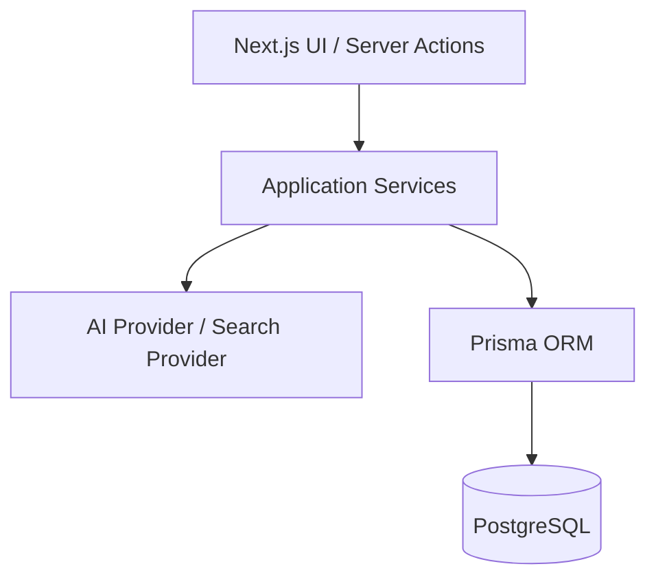
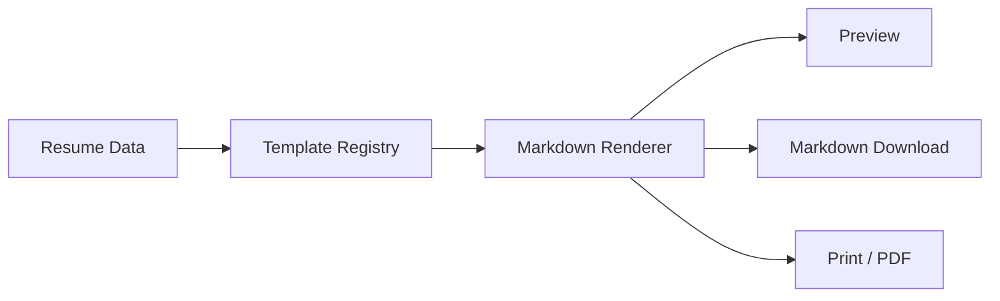

# Personal Job Agent

[](https://github.com/zhangjf314/Job-Agent/actions/workflows/ci.yml)

基于 Next.js、Prisma 和 PostgreSQL 构建的个人求职工作流平台，覆盖职业档案、简历生成、JD 分析、岗位管理、投递跟踪和质量观测。

当前版本是面向单用户 Demo 的 MVP：AI 默认使用确定性的 Mock Provider，岗位搜索默认使用 Fixture Provider。项目已经预留 OpenAI-compatible AI 接口以及 Tavily/Bing 搜索接口，但默认配置不会调用真实外部服务，也不需要 API Key。

## 功能概览

- 职业档案：教育、技能、项目、经历、证书、奖项和求职偏好
- 简历中心：通用简历、JD 定制简历、Markdown 下载与浏览器打印
- 简历模板：极简、简洁大方、深色、带证件照四种模板
- JD 分析：职责、硬技能、软技能、关键词、匹配项、差距和风险
- 职业策略：方向建议、技能差距、求职策略和行动计划
- 岗位管理：手动文本、公开 URL、CSV/Excel 和 Fixture 搜索结果导入
- 岗位质量：归一化、去重、风险识别、匹配评分和推荐解释
- 投递工作台：投递漏斗、任务、面试轮次、反馈和 Offer 对比
- 质量观测：人工评分以及 AI 调用耗时、Token 和失败记录
- 数据管理：Demo 数据初始化、统计、JSON 导出和删除

## 技术栈

| 类别 | 技术 |
| --- | --- |
| Web | Next.js 15、React 19、TypeScript |
| UI | Tailwind CSS、Radix UI、Lucide |
| 数据 | PostgreSQL 16、Prisma 6 |
| 校验与表单 | Zod、React Hook Form |
| 测试 | Vitest、Testing Library、jsdom |
| 工程化 | ESLint、GitHub Actions、Docker Compose |
| 可扩展接口 | OpenAI-compatible Provider、Tavily/Bing Search Provider |

上述 Provider 接口不代表真实服务已经启用；默认运行模式仍是 Mock AI 与 Fixture 搜索。

## 架构



简历模板引擎将模板选择与各输出入口统一起来：



模板骨架位于 `template/*.md`，元数据注册表位于 `services/resume-templates/registry.ts`，统一渲染入口位于 `services/resume-templates/renderer.ts`。占位符与扩展规范见 `docs/resume-template-system.md`。

## 页面展示

仓库暂未提交界面截图，避免误将本机路径、浏览器信息或真实求职数据带入公共历史。后续截图将仅使用仓库自带的虚构 Demo 数据，并放入 `docs/images/`。

## 本地运行

### 前置条件

- Node.js 24.16.0（当前本地与 CI 验证版本）
- npm
- Docker Desktop + Docker Compose，或可访问的 PostgreSQL 16

### 方案 A：Docker PostgreSQL

```powershell
git clone https://github.com/zhangjf314/Job-Agent.git
cd Job-Agent
npm ci
Copy-Item .env.example .env
npm run db:docker
npm run db:wait
npm run prisma:generate
npx prisma migrate deploy
npm run seed
npm run dev
```

访问 `http://localhost:3000`。

macOS/Linux 可将复制环境文件的命令替换为：

```bash
cp .env.example .env
```

`.env.example` 只包含本地演示配置。请勿提交包含真实数据库连接串或 API Key 的 `.env`。

### 方案 B：本机 PostgreSQL

复制 `.env.example` 后，将 `DATABASE_URL` 改为自己的开发数据库连接串，然后执行：

```powershell
npm ci
npm run prisma:generate
npx prisma migrate deploy
npm run seed
npm run dev
```

`npm run seed` 会重建 `DEMO_USER_EMAIL` 对应的虚构 Demo 用户，默认是 `demo@example.com`。不要把真实求职数据用于公共演示。

### 方案 C：云 PostgreSQL

复制 `.env.example` 后，将 `DATABASE_URL` 改为云 PostgreSQL 提供的连接串。不要把连接串提交到 Git；确认网络和 TLS 参数符合服务商要求后，执行：

```powershell
npm ci
npm run prisma:generate
npx prisma migrate deploy
npm run seed
npm run dev
```

### 常见数据库问题

如果 Prisma 报告 `P1001`，表示 `DATABASE_URL` 指向的 PostgreSQL 当前不可访问。请检查服务是否启动、主机和端口是否正确，以及数据库和用户是否已经创建。

如果 Docker 拉取 `postgres:16-alpine` 时出现 `failed to fetch anonymous token`，问题通常来自 Docker Hub 网络、代理、镜像源或登录状态，并不表示 Prisma Schema 或应用代码损坏。可在修复 Docker 网络后重试，或改用方案 B/C。

## 常用命令

```bash
npm run dev              # 启动 Next.js 开发服务器
npm run build            # 生产构建
npm run check            # TypeScript + ESLint + Vitest
npm run doctor           # 检查本地运行前置条件
npm run db:docker        # 启动 Docker PostgreSQL
npm run db:down          # 关闭 Docker 服务
npm run db:status        # 查看 PostgreSQL 容器状态
npm run prisma:generate  # 生成 Prisma Client
npm run seed             # 重建虚构 Demo 数据
```

## 质量门禁

当前本地基线：

- TypeScript：通过
- ESLint：通过
- Vitest：37 个测试文件、115 项测试通过
- Prisma Schema：校验通过
- PostgreSQL：9 条 Migration 可在空数据库完整部署
- Next.js Production Build：通过

`.github/workflows/ci.yml` 为 Pull Request 和推送到 `main` 提供两套门禁：

- Ubuntu：PostgreSQL 16、Prisma generate/validate/migrate、完整工程检查和生产构建
- Windows：Prisma generate/validate 与完整工程检查，用于发现路径和跨平台问题

两个 Job 都固定使用 Mock AI、Fixture 搜索，并关闭真实 Web Search 和公司页面抓取。

## 当前边界

- 默认只使用 Mock AI，不代表真实 LLM 已完成联调
- 默认只使用 Fixture 搜索，不代表 Tavily 或 Bing 已启用
- 不登录招聘平台，不绕过 CAPTCHA 或反爬机制
- 不执行自动投递、不发送邮件、不代替用户操作外部平台
- 当前是单用户 Demo 模式，尚无生产级认证与多用户隔离
- 尚未提供正式生产部署
- 带证件照模板可以无照片安全渲染，但当前没有照片上传功能

## 数据与隐私

简历、投递记录、面试反馈和 Offer 都属于个人敏感信息。本项目仓库只包含虚构 Demo/Fixture 数据；本地或未来部署时应使用访问控制保护真实数据，并确保 `.env`、数据库备份、日志和导出文件不进入 Git。

## 路线图

- OpenAI-compatible 真实 LLM Provider 联调、结构化输出与失败降级
- Tavily/Bing 真实 Web Search 配置与合规边界验证
- 多用户认证与数据隔离
- 可观测性、成本统计和最小真实 Smoke Test
- 生产部署与备份恢复方案
- 实时模板预览与可选照片上传

路线图中的能力尚未完成，不应视为当前功能。

## License

当前仓库暂未附加开源许可证。在确认全部源码和四份简历模板的再许可权之前，不声明可自由复制、修改或再分发。
