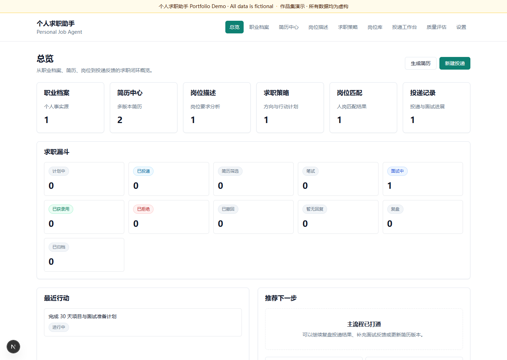
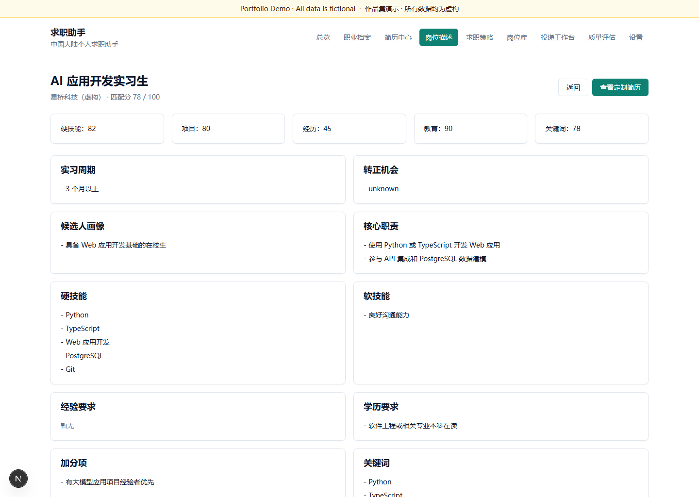
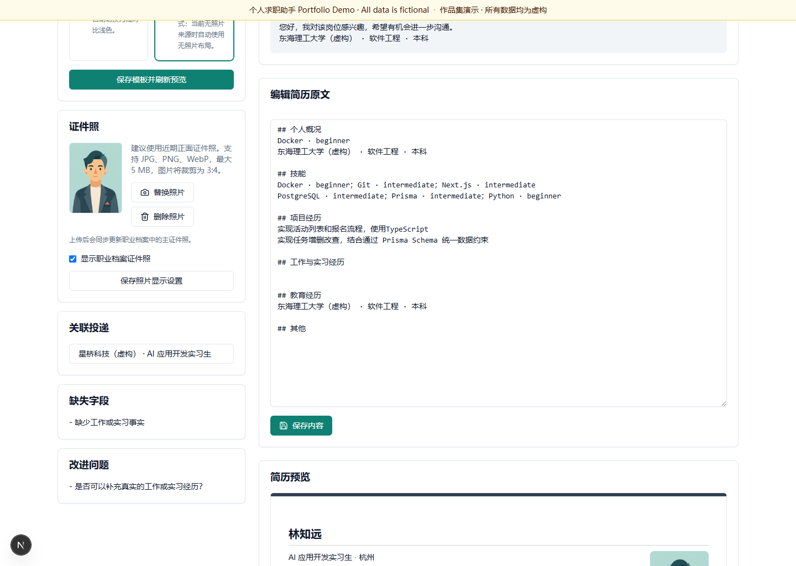
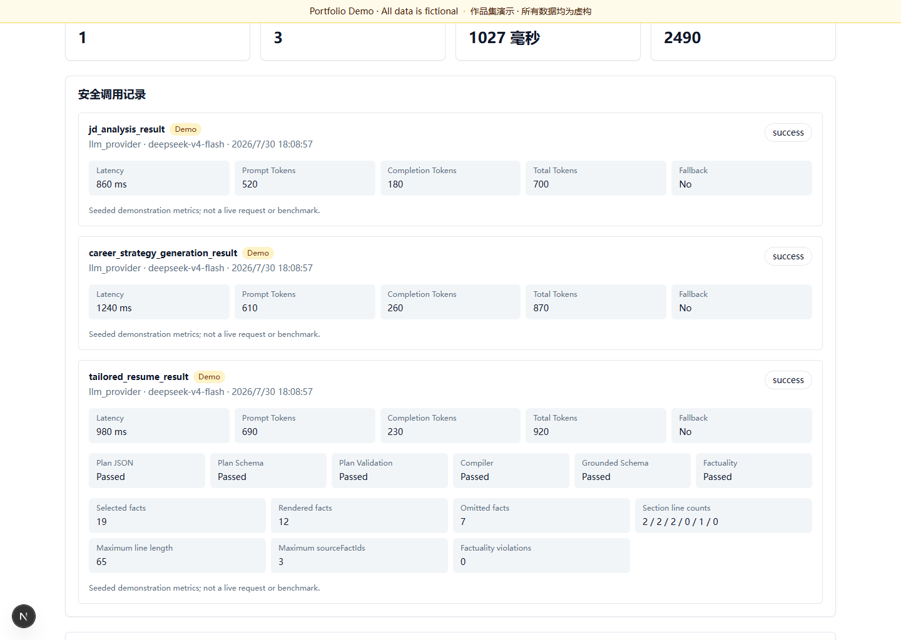
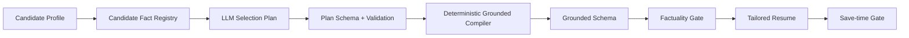

# Personal Job Agent

> AI-powered job-search, resume-tailoring and application workspace

[](https://github.com/zhangjf314/Job-Agent/actions/workflows/ci.yml)

Personal Job Agent 是一个覆盖职业档案、简历、JD 分析、岗位管理、职业策略与投递复盘的个人求职工作台。它使用 **LLM Selection Plan + Deterministic Grounded Compiler**：模型只选择和排序候选人事实，系统负责最终文本、结构与引用，从而让岗位个性化简历可验证、可追踪，并阻止岗位要求被改写成虚构经历。

## 产品截图

所有截图均来自独立 Portfolio 数据库，人物、学校、公司、岗位和项目均为虚构数据。

| Dashboard | JD Analysis |
| --- | --- |
|  |  |
| Tailored Resume | Evaluation |
|  |  |

完整截图：

- [Resume Center](docs/screenshots/02-resume-center.png)
- [Resume Detail](docs/screenshots/03-resume-detail.png)
- [Application Materials](docs/screenshots/06-application-materials.png)
- [Career Strategy](docs/screenshots/07-career-strategy.png)
- [Application Workbench](docs/screenshots/08-application-workbench.png)
- [AI Settings](docs/screenshots/09-ai-settings.png)
- [Profile Photo Editor](docs/screenshots/11-profile-photo-editor.png)
- [Smart One-Page Print](docs/screenshots/12-smart-one-page-print.png)

## 核心功能

- 职业档案：教育、技能、项目、经历和求职偏好
- 档案证件照：本地上传、3:4 裁剪、WebP 规范化、替换和删除
- 简历中心：通用简历、岗位定制简历、模板、Markdown 与打印/PDF
- 智能一页打印：在可读性下限内自动适配；无法安全适配时保留标准分页
- JD 分析：职责、技能、关键词、匹配项、缺口和风险
- 定制简历：事实选择 Plan、确定性编译、Grounded Schema 与事实门禁
- 申请材料：自我介绍、投递邮件和招聘沟通话术
- 职业策略：岗位方向、技能缺口、搜索策略和 30 天行动计划
- 岗位库：手动、文件、公开 URL 与 Fixture 数据导入
- 投递工作台：漏斗、任务、面试反馈与 Offer 对比
- Evaluation：Provider 调用耗时、Token、Pipeline 状态和安全指标

## 核心架构



更多细节：

- [Portfolio 系统架构](docs/architecture/portfolio-architecture.md)
- [定制简历 Pipeline](docs/architecture/tailored-resume-pipeline.md)
- [3–5 分钟演示脚本](docs/demo/portfolio-demo-script.md)
- [面试讲解要点](docs/demo/interview-talking-points.md)

## 为什么不让 LLM 直接写最终简历

完整对象由模型直接生成时容易出现 Schema 漂移、数组超限、文本超长、岗位要求事实化和 Repair 不稳定。当前架构将职责拆开：

- LLM 只做相关性选择、section 分配和优先级排序
- Plan Schema 与 validator 拒绝未知、重复及 `J_REQ_*` ID
- Compiler 从结构化候选人事实生成完整文本、引用和申请材料
- Grounded Schema 与事实门禁作为最终安全边界
- 只有全部门禁通过后才能保存公共业务对象

## 真实 Provider 验收

一次受控 Smoke 已在 `deepseek-v4-flash` 上完成：

```text
Provider: DeepSeek OpenAI-compatible API
External requests: 1
Prompt tokens: 704
Completion tokens: 247
Total tokens: 951
Latency: 2111 ms
Fallback: false
Factuality violations: 0
```

这只是单次功能验收，不代表性能或成本基准。Portfolio Demo 不会调用外部 LLM。

## 工程质量

- 63 个测试文件、618 项自动化测试
- Linux 与 Windows GitHub Actions
- Prisma migrations：10
- TypeScript、ESLint、Prisma validate、Production Build 全部门禁
- 独立 Demo 数据库、幂等 seed、截图前后 LLMCallLog 数量校验

## 技术栈

| 范畴 | 技术 |
| --- | --- |
| Web | Next.js 15、React 19、TypeScript |
| UI | Tailwind CSS、Radix UI、Lucide |
| 数据 | PostgreSQL 16、Prisma 6 |
| 验证 | Zod、Grounded Schema、Deterministic Compiler |
| AI | OpenAI-compatible Provider、DeepSeek 验收、Mock Provider |
| 测试 | Vitest、Testing Library、jsdom、Playwright |
| 工程 | ESLint、GitHub Actions、Docker Compose |

## 本地运行

### Normal development

可按环境选择数据库启动方式：

- 方案 A：Docker PostgreSQL — 使用下方 `db:docker`、`db:wait` 命令
- 方案 B：本机 PostgreSQL — 运行 `npm run db:create` 后迁移和 seed
- 方案 C：云 PostgreSQL — 在 `.env` 中配置服务商提供的 `DATABASE_URL`

```powershell
npm ci
Copy-Item .env.example .env
npm run db:docker
npm run db:wait
npx prisma migrate deploy
npm run seed
npm run dev
```

若 Docker 拉取出现 `failed to fetch anonymous token`，先检查 Docker Desktop、代理和 registry
网络；若 Prisma 返回 `P1001`，检查 PostgreSQL 是否启动、端口与 `DATABASE_URL` 是否一致，
也可运行 `npm run doctor` 获取诊断。

### Portfolio demo

先安装并准备 PostgreSQL，然后：

```powershell
npm ci
Copy-Item .env.portfolio.example .env.portfolio.local
# 仅在本地编辑凭证；数据库名必须保持 personal_job_agent_portfolio
npm run portfolio:db:setup
npm run portfolio:verify
npm run portfolio:dev -- --port 3100
```

本机已有 `.env` 时，`portfolio:db:setup` 可自动生成被 Git 忽略的 `.env.portfolio.local`，只复用本地连接凭证并替换为独立数据库名。

重置 Demo：

```powershell
npm run portfolio:db:reset
npm run portfolio:verify
```

## Demo 模式

- Banner 明确显示 `Portfolio Demo · All data is fictional`
- 所有候选人、学校、公司、项目、岗位和日志数值均为虚构数据
- `AI_PROVIDER=mock`，不会调用外部 LLM
- 使用独立 `personal_job_agent_portfolio` 数据库
- seed 与 reset 可重复执行，固定记录数量
- 定制简历仍通过正式 Compiler、Schema 和事实门禁

生成并审计截图：

```powershell
npx playwright install chromium
npm run portfolio:screenshots
npm run portfolio:screenshot:audit
```

## 安全边界

- 不自动投递、不发送邮件、不代替用户操作招聘平台
- 不登录招聘网站，不绕过 CAPTCHA 或反爬机制
- 不保存 Prompt、原始响应或 `reasoning_content`
- Mock fallback 默认关闭
- JD requirement 不能作为候选人事实
- Demo 数据库与主开发数据库隔离
- `.env`、`.env.portfolio.local`、数据库 dump、日志和临时浏览器数据不得提交

## Repository Structure

```text
app/                         Next.js 页面与 Server Actions
components/                  UI 组件和 Demo Banner
services/ai/                 Provider、Plan、Compiler、事实门禁与观测
services/                    简历、JD、策略、岗位和投递服务
prisma/                      Schema 与 10 条 migration
scripts/portfolio-*.ts       Demo DB、seed、验证、截图与审计
docs/architecture/           系统与 Pipeline 文档
docs/demo/                   演示脚本和面试讲解
docs/screenshots/            仅含虚构数据的正式截图
tests/                       单元、服务、Pipeline 与安全回归测试
```

## Roadmap

- 更多合规的招聘平台数据导入
- 更完整的职位搜索与归一化
- 扩展简历模板与可访问性
- Evaluation 趋势、成本与质量分析

尚未实现的能力不会在本项目中描述为已完成。

## License

仓库当前未附加开源许可证。在明确源码与简历模板的再授权范围前，不声明可自由复制、修改或再分发。
