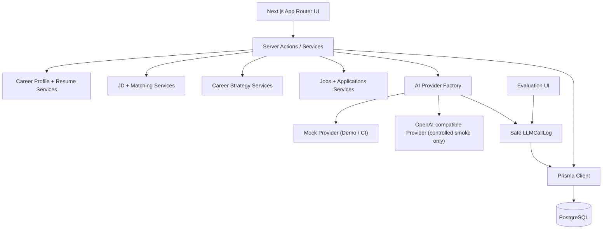
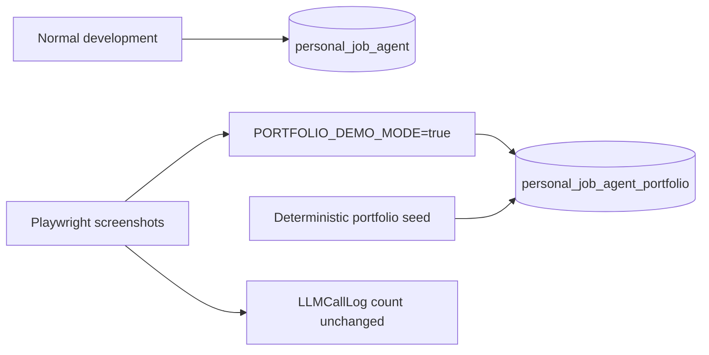

# Personal Job Agent Portfolio Architecture

## 系统模块

## Portfolio 数据隔离

`portfolio:db:setup` 和 `portfolio:db:reset` 都会在任何写操作前验证数据库名。reset 只接受 `personal_job_agent_portfolio`；`.env.portfolio.local` 被 Git 忽略。

## Provider Factory 与安全日志

Provider Factory 根据配置选择 Mock 或 OpenAI-compatible Provider。Portfolio 配置固定使用 Mock，seed 不调用 Provider。真实调用观测只记录 operation、provider、model、状态、耗时、Token、fallback 和白名单 metadata；不记录 Prompt、原始响应、推理正文、事实正文或 Secret。

## 主要数据模块

- Career Profile：候选人结构化事实来源
- Resume：通用与岗位定制版本
- JD Analysis：岗位要求、匹配项、缺口和风险
- Career Strategy：方向、技能缺口、搜索与行动计划
- Job / Application：岗位归一化、匹配、投递和反馈
- Evaluation / LLMCallLog：人工评估和安全 Provider observability

## 保存边界

所有定制简历在保存前经过 Plan Schema、Plan Validation、Compiler、Grounded Schema 与 Factuality Gate。Portfolio seed 复用同一纯函数链路，只有公共业务对象校验通过后才写入独立数据库。
