# Tailored Resume Pipeline

## 数据流

```mermaid
flowchart LR
    Profile["Structured Candidate Profile"] --> Atoms["Project Fact Atoms"]
    Profile --> Registry["Candidate Fact Registry (F_*)"]
    Atoms --> Registry
    JD["JD Analysis (J_REQ_*)"] --> Planner["LLM Selection Planner"]
    Registry --> Planner
    Planner --> PlanSchema["Strict Plan Schema"]
    PlanSchema --> Validator["Deterministic Plan Validator"]
    Validator --> ProjectCompiler["Deterministic Project Compiler"]
    ProjectCompiler --> Compiler["Deterministic Grounded Compiler"]
    Registry --> Compiler
    Compiler --> Grounded["Grounded Schema"]
    Grounded --> Factuality["Complete Factuality Gate"]
    Factuality --> Public["Public Tailored Resume"]
    Public --> Save["Save-time Gate"]
```

## Candidate Fact Registry

Registry 只从职业档案的结构化字段建立候选人事实。事实 ID 使用 `F_*`；JD-only requirement 使用 `J_REQ_*`，只能影响相关性，不能作为候选人证据。Render descriptor 只从候选人事实构造安全短语，不使用 JD 或模型自由文本。

完整项目描述始终保留在职业档案。技术、职责、功能、难点、方案、工程实践、结果和指标被确定性地原子化为项目事实，并映射为稳定 `F_PROJECT_*`；每个事实同时保留项目归属、类型、角色、断言强度和可渲染状态。长段落不会按标点猜测拆分，无法安全解析的内容标记为不可渲染并交由用户确认。

## Plan Schema

Plan 仅包含固定字段、canonical section enum 和候选人事实 ID：

- `sections`
- `applicationMaterials`
- `changedSections`
- `priorityFactIds`
- `projectRewrites`

`projectRewrites` 也只包含项目引用、固定 pattern enum 和同项目事实 ID。Plan 不包含 title、line、text、kind、order、项目正文、邮件或任意 JSON path。validator 拒绝 JD ID、未知 ID、重复 ID、无效 priority、不可渲染事实、跨项目事实、pattern/category 不匹配和不合理总使用次数。

## Deterministic Compiler

Compiler 固定生成六个 section、标题、顺序、每节最多两行、每行最多 80 字、最多八个来源 ID，并使用模板生成三类申请材料。它只装入完整安全短语，不截断、不添加省略号，也不承诺展示所有事实。

项目描述编译器使用七种固定连接模式，将 Plan 选择的完整 `canonicalText` 编译为最多两条项目描述；它不调用 LLM，不改变事实强度，不添加技术、指标、项目类型或角色。最低合法组合超过 80 字时直接失败，不截断正文。

## Grounded Schema 与事实门禁

Grounded Schema 检查最终对象拓扑、长度、数组、claim kind 和来源数量。Factuality Gate 检查：

- 未知或缺失来源
- JD requirement 事实化
- 不支持的技能或强度升级
- 虚构工作、实习、奖项、指标、AI/LLM 项目
- 未知或跨项目 atom、项目类型/角色/强度升级、非确定性项目正文

确定性 Compiler 若仍产生事实违规，会被分类为代码 Bug，不会调用第二次 LLM Repair 掩盖问题。

## Evaluation Logging

Pipeline 只记录安全状态和计数，包括 Plan JSON、Plan Schema、Plan Validation、Project Plan、Project Validation、Project Compiler、Grounded Schema、Factuality、selected/rendered/omitted facts、section line counts 与最大长度。事实 ID、事实正文、完整项目描述、最终项目 bullet、JD、简历正文和申请材料正文不会进入日志。

## Portfolio Seed

Portfolio seed 使用人工审核的固定 Plan Fixture，但仍调用正式 registry、validator、compiler、Grounded Schema、factuality gate 和公共结果转换。该路径外部请求数为零。
